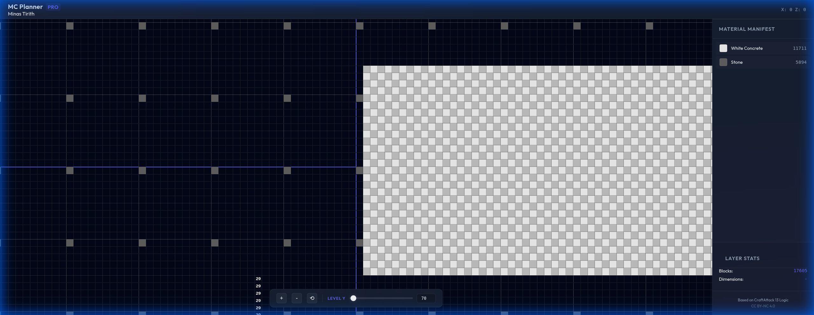
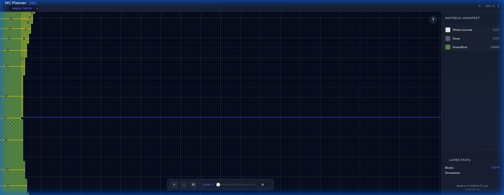

# 🏰 MC Planner: Minas Tirith Edition


**The ultimate planning tool for recreating the White City on your multiplayer server.**

Based on the architecture popularized by **CraftAttack 13**, this tool generates precise, layer-by-layer blueprints for Minas Tirith, including the 7 concentric tiers, the Great Prow, and the Tower of Ecthelion.

---

## 📸 Functionality

### Overview
Explore the full scale of the city structure.


### Detail View
Zoom in to see **automatic block counts** and the **smart grid** helper.


### Dimension Detail
Zoom in to see clear **width and depth arrow indicators**.


## 🚀 Usage

### Quick Start
Due to browser security policies (CORS), this application must be run via a local web server.

1. **Clone & Enter Directory**
   ```bash
   git clone https://github.com/derlemue/mc-planner.git
   cd mc-planner
   ```

2. **Start Server**
   ```bash
   python3 -m http.server 8080
   ```

3. **Open App**
   Visit [http://localhost:8080](http://localhost:8080) in your browser.

### Key Features
- **✨ Procedural Geometry**: No static map download needed. The geometry is math-generated.
- **🔢 Auto-Count Labels**: Zoom in, and the walls will tell you exactly how long they are.
- **📐 Smart Grid**: Thicker lines every 5 and 10 blocks for easy measurement.
- **🏁 Checkerboard**: Visual block distinction for precise placement.
- **📜 Material Manifest**: Real-time Sidebar showing block counts for the active layer.

## Inspiration
Based on the architecture of Minas Tirith as seen in *The Lord of the Rings* and popularized in Minecraft by projects like **CraftAttack 13**.
(Reference: [Youtube: CraftAttack 13 Minas Tirith](https://www.youtube.com/watch?v=97VrC-TdKUw))

## License
This project is licensed under the **Creative Commons Attribution-NonCommercial 4.0 International (CC BY-NC 4.0)**.
You are free to use, adapt, and share this material for non-commercial purposes with attribution.
